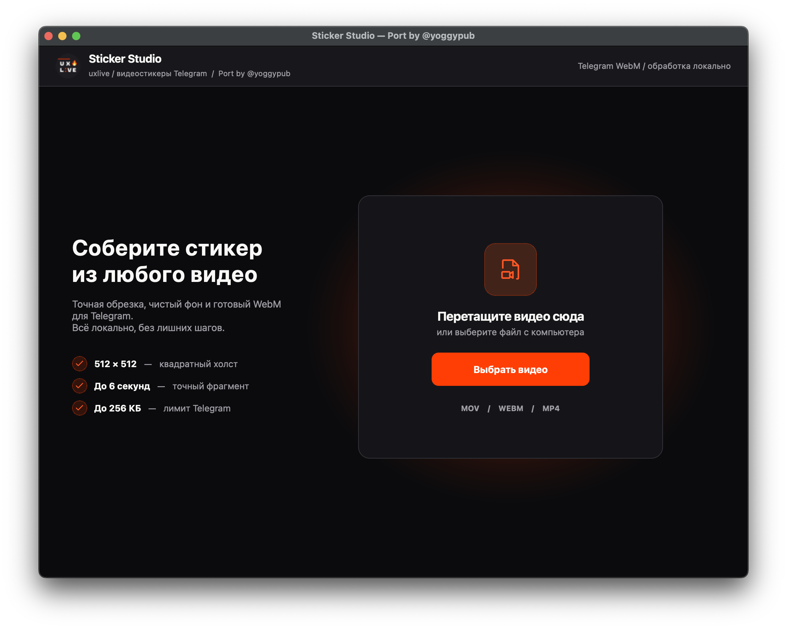
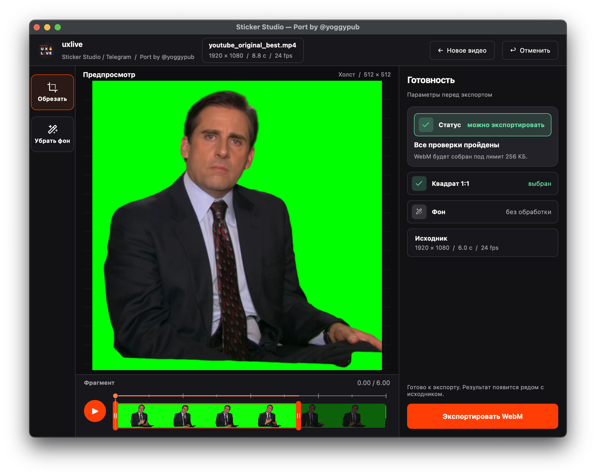

# Sticker Studio for macOS

macOS-порт [uxlive Sticker Studio](https://github.com/grozovsky/StickerStudio) — редактора видеостикеров для Telegram.

Обрезка, точный выбор фрагмента, удаление однотонного фона и экспорт в готовый WebM выполняются локально на Mac: без Adobe, облачных сервисов и командной строки.

Перетащите MOV, WebM или MP4, выберите квадратный кадр и фрагмент до 6 секунд. Sticker Studio подготовит WebM до 512 × 512 без звука, сохранит прозрачность и автоматически постарается уложить результат в лимит 256 КБ.

> Это независимый macOS-порт оригинального Sticker Studio. 





## Скачать

Готовая macOS-сборка доступна в разделе **Releases**:

**`Sticker Studio.app` — версия 1.0.0**

Скачайте ZIP-архив, распакуйте его и перенесите `Sticker Studio.app` в папку **Программы / Applications**.

### Системные требования

- Mac с Apple Silicon: M1 / M2 / M3 / M4 и новее
- macOS
- Отдельная установка Python, FFmpeg или других зависимостей не требуется

Текущая готовая сборка — **arm64** и предназначена для Apple Silicon.

## Первый запуск на macOS

Текущая сборка не подписана сертификатом **Apple Developer ID** и не нотарифицирована Apple, поэтому Gatekeeper может заблокировать первый запуск.

Сначала попробуйте стандартный способ:

1. Перенесите `Sticker Studio.app` в **Applications**.
2. Нажмите по приложению правой кнопкой мыши.
3. Выберите **Открыть**.
4. Подтвердите запуск.

Если macOS всё ещё блокирует приложение, откройте:

**System Settings → Privacy & Security → Open Anyway**

В крайнем случае можно снять quarantine-флаг только с этого приложения через Terminal:

```bash
xattr -dr com.apple.quarantine "/Applications/Sticker Studio.app"
```

После этого приложение запускается обычным двойным кликом.

## Возможности

- **Вход:** MOV, WebM с альфа-каналом или обычный MP4; исходник не покидает компьютер
- **Таймлайн-филмстрип:** точный отрезок от 0,5 до 6 секунд и зацикленный предпросмотр без звука
- **Обрезка 1:1:** квадратный кадр с точным позиционированием; итоговый холст до 512 × 512
- **Удаление фона:** пипетка, Gain, Shrink/Grow, сглаживание края и despill
- **Exact Preview:** точный предпросмотр результата перед экспортом
- **Умный fps:** частота исходника сохраняется; для материала выше 30 fps приложение предлагает экспортировать в 30 fps
- **Экспорт:** VP9 WebM с прозрачностью и двухпроходным автоподбором битрейта под лимит 256 КБ
- **Локальная обработка:** видео не загружается в облако

## Управление

- `Space` — Play / Pause
- `←` / `→` — покадровая навигация
- `⌘O` — новое видео
- `C` — обрезка
- `B` — удаление фона
- `⌘E` — экспорт
- `⌘Z` — отмена

## Как пользоваться

1. Откройте или перетащите видео.
2. Выберите нужный фрагмент на таймлайне.
3. При необходимости сделайте квадратный кроп.
4. При необходимости включите **Удалить фон** и настройте Chroma Key.
5. Проверьте результат в предпросмотре.
6. Нажмите **Экспортировать WebM**.

Готовый файл сохраняется рядом с исходным видео.

## Сборка из исходников

Для разработки рекомендуется Python 3.14 и Apple Silicon Mac.

```bash
python3 -m venv .venv
source .venv/bin/activate
pip install -r requirements.txt
python build_app.py
```

Готовое приложение появится в:

```text
dist/Sticker Studio.app
```

Сборщик использует PyInstaller и включает необходимые Python-зависимости и FFmpeg внутрь `.app`.

## FFmpeg

В готовую сборку включён FFmpeg:

- FFmpeg 8.1.2
- macOS arm64
- libvpx 1.16.0
- SHA-256 бинарника:

```text
eaf91238e104dd0e262bc6510e25061855cc99a6955a721b0ac99660d58c473d
```

Используется сборка [Martin Riedl's FFmpeg Build Server](https://ffmpeg.martin-riedl.de/).

Подробности о сторонних компонентах и лицензиях: [THIRD_PARTY_NOTICES.md](THIRD_PARTY_NOTICES.md).

## Как это работает

Экспорт выполняется через `libvpx-vp9` в WebM с поддержкой альфа-канала. Приложение использует двухпроходное кодирование и при необходимости повторяет экспорт с другим битрейтом, чтобы уложить файл в лимит 256 КБ.

Для совместимости видеостикера приложение также корректирует поле `Duration` контейнера WebM/EBML до `2.900 s`, не обрезая реальные временные метки видеопакетов выбранного фрагмента.

## Оригинальный проект и авторство

Оригинальный **uxlive Sticker Studio** для Windows:

https://github.com/grozovsky/StickerStudio

Оригинальный проект и концепция — **grozovsky / UX Live**.

macOS-порт — **@yoggypub**.

Подробные благодарности: [CREDITS.md](CREDITS.md).

---

**Port by [@yoggypub](https://t.me/yoggypub)**  
Original project: [UX Live / Sticker Studio](https://github.com/grozovsky/StickerStudio)
